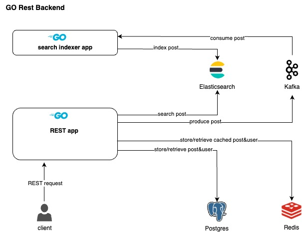

# go-prototype-rest-backend
A rest backend app build using golang.



## Tech Stack 
| Item                                       | version  | desc                                                |
| :----------------------------------------- | :------: | --------------------------------------------------: |
| golang                                     |   1.22   |                                                     |
| http router - chi                          |          | github.com/go-chi/chi/v5                            |
| redis client - go-redis                    |          | github.com/redis/go-redis/v9                        |
| kafka client - confluent-kafka-go          |          | github.com/confluentinc/confluent-kafka-go/v2/kafka |
| elasticsearch client - go-elasticsearch    |          | github.com/elastic/go-elasticsearch/v8              |
| godotenv                                   |  v1.5.1  | github.com/joho/godotenv                            |
| validator                                  |          | github.com/go-playground/validator/v10              |

## Project Structure
```
rest-backend
├── cmd
│   ├── api
│   │   ├── envvar.go
│   │   └── main.go
│   ├── elasticsearch-indexer-kafka
│   │   ├── envvar.go
│   │   └── main.go
│   ├── internal
│   │   └── common
│   │       ├── db.go
│   │       ├── elasticsearch.go
│   │       ├── env.go
│   │       └── kafka.go
│   └── migrate
│       └── migrations
├── devops
│   ├── docker
│   ├── helm
│   └── scripts
├── docs
├── internal
│   ├── api
│   │   ├── dto
│   │   │   ├── post.go
│   │   │   └── user.go
│   │   ├── handler
│   │   │   ├── handlers.go
│   │   │   ├── posts.go
│   │   │   └── users.go
│   │   ├── router.go
│   │   └── service
│   │       ├── posts.go
│   │       └── user.go
│   ├── common
│   │   ├── domain
│   │   │   ├── model
│   │   │   │   ├── post.go
│   │   │   │   └── user.go
│   │   │   └── store
│   │   │       ├── db.go
│   │   │       ├── messagebroker.go
│   │   │       └── search.go
│   │   └── error.go
│   └── infrastructure
│       ├── elasticsearch
│       │   └── post.go
│       ├── envvar
│       ├── kafka
│       │   └── post.go
│       ├── postgres
│       │   ├── postgres.go
│       │   ├── posts.go
│       │   ├── roles.go
│       │   └── users.go
│       └── redis
│           └── postgres
│               ├── posts.go
│               ├── roles.go
│               └── users.go
├── go.mod
├── go.sum
├── docker-compose-dev-instance.yml
├── Makefile
├── README.md
└── shell.nix
```
## Project setup 

### Project Prerequisite 
* golang
* docker instance - required for running testcontainers related test. check shell.nix to configure remote docker
* delve - [optional] for debugging go projects
* air - [optional] for hot/live reloading go projects

### Project Initial setup

#### Init the module 
```
go mod init github.com/kannancmohan/go-prototype-rest-backend
```

#### [optional] Init air for hot reloading
```
air init
```
adjust the generated '.air.toml' file to accommodate project specif changes

### Project Build & Execution

#### Project environment variables 

* For development environment:

     The env variables can be defined in .envrc file. The direnv tool will automatically load the env variables from .envrc file
     
     if you update the .envrc file on the fly, use command "direnv reload" to reload the env variables

#### API App Build & Execution

##### Build API App
```
make build
```

##### Run API App
```
make run-api
```

##### Run API App Test
```
make test
```

##### Run API App Test (skip testcontainers related test)
```
make test-skip-docker-tests
```

#### Search(elasticsearch) indexer App Build & Execution

##### Build search indexer App
```
make build
```

##### Run search indexer App
```
make run-indexer
```

#### Project DB migration
##### To add new migration file

```
make migration-create user_table
```
##### To migrate db

```
make migration-up
```

##### To revert db migration

```
make migration-down
```

## Additional 

"accept interfaces and return concrete types(struct)" 